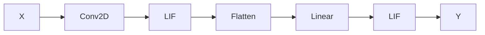

# Introduction


SNNAX is a lightweight library built on **Equinox** and **JAX** to provide a spiking neural network (SNN) simulator for deep learning. It is designed to be user-friendly and flexible, allowing users to define custom SNN layers while leveraging common deep learning layers from Equinox. SNNAX is fully compatible with JAX, enabling the use of JAX's function transformation features like vectorization with `jax.vmap`, automatic differentiation, and JIT compilation with XLA.

## Quick Start

The following code demonstrates how to define a simple SNN in SNNAX using the [`snnax.snn.Sequential`](./200_architecture/201_composed.md#sequential) class to stack layers of SNNs and Equinox layers into a feed-forward architecture:

```python
import jax
import jax.numpy as jnp

import equinox as eqx
import snnax.snn as snn

import optax

model = snn.Sequential(eqx.Conv2D(2, 32, 7, 2, key=key1),
                        snn.LIF((8, 8), [.9, .8], key=key2),
                        snn.flatten(),
                        eqx.Linear(64, 11, key=key3),
                        snn.LIF(11, [.9, .8], key=key4))
```



Next, define a loss function for a single sample and use JAX's vectorization features to create a batched loss function.
Note that the model's output is a tuple of membrane potentials and spikes. For a feed-forward SNN, use the last element of the spike list, `out_spikes[-1]`, and sum the spikes across time to get the spike count.

```python
# Simple batched loss function

@partial(jax.vmap, in_axes=(0, 0, 0))
def loss_fn(in_states, in_spikes, tgt_class):
out_state, out_spikes = model(in_states, in_spikes)

    # Spikes from the last layer are summed across time
    pred = out_spikes[-1].sum(-1)
    loss = optax.softmax_cross_entropy(pred, tgt_class)
    return loss


# Calculating the gradient with Equinox PyTree filters and
# subsequently jitting the resulting function
@eqx.filter_jit
@eqx.filter_value_and_grad
def loss_and_grad(in_states, in_spikes, tgt_class):
return jnp.mean(loss_fn(in_states, in_spikes, tgt_class))
```

Finally, train the model by feeding it input spike trains and states. Initialize the states of the SNN using the `init_states` method of the [`snnax.snn.Sequential`](./200_architecture/201_composed.md#sequential) class.

```python
# ...
# Simple training loop

for in_spikes, tgt_class in tqdm(dataloader):
    # Initializing the membrane potentials of LIF neurons
    states = model.init_states(key)

    # Jitting with Equinox PyTree filters
    loss, grads = loss_and_grad(states, in_spikes, tgt_class)

    # Update parameter PyTree with Equinox and optax
    updates, opt_state = optim.update(grads, opt_state)
    model = eqx.apply_updates(model, updates)
```

Fully worked-out examples can be found in the examples directory.
