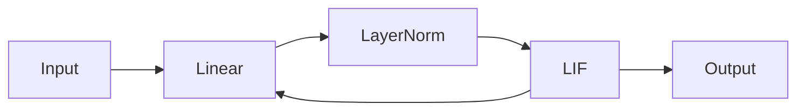
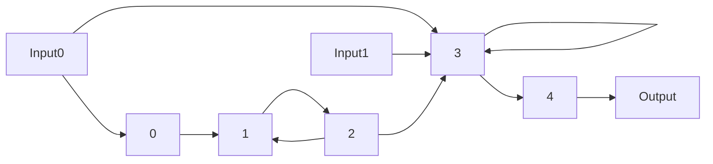

# Introduction

To customize a model's architecture, SNNAX provides a simple way to define the structure of the model.

SNNAX offers two primary methods for defining the architecture:

- [`snnax.snn.architecture.StatefulModel`](./200_intro.md#statefulmodel): Allows for creating custom SNNs.
- [`snnax.snn.composed`](./201_composed.md): Provides predefined architecture classes that can be used to build your model.

## StatefulModel

The `StatefulModel` class enables the creation of custom SNNs with nearly arbitrary connectivity, defined through a graph structure known as the connectivity graph. It inherits from `eqx.Module` to be a callable pytree.

#### Arguments

- `graph_structure (GraphStructure)`: A `GraphStructure` object that specifies the network topology.
- `layers (Sequence[eqx.Module])`: The computational building blocks of the model.
- `forward_fn (Callable)`: The evaluation procedure/loop for the model. Defaults to [`default_forward_fn`](../400_functions.md#default_forward_fn).

### Methods

- `init_state(in_shape, shapes=None, key=PRNGKey)`: Initializes the state of the model by recursively calling the init functions of the stateful layers. Non-stateful layers are initialized as `None` and their output shape is computed using a mock input.

  - **Arguments**:

    - `in_shape (Union[Sequence[Tuple[int]], Tuple[int]])`: Shape of the input.
    - `shapes (Union[Sequence[Tuple[int]], None])`: Optional shapes for the layers.
    - `key (PRNGKey)`: Random key for initialization.

  - **Returns**: `Sequence[Array]` containing the initial state of the model.

- `__call__(input_states, input_batch, key, burnin=0)`: The forward function that performs the actual computation when the model is called. Uses `lax.scan` to iterate over the layers.

  - **Arguments**:

    - `input_states (Sequence[jnp.ndarray])`: Initial states of the model.
    - `input_batch`: Batch of input data.
    - `key (jrand.PRNGKey)`: Random key for the computation.
    - `burnin (int)`: Number of initial steps to ignore in backpropagation.

  - **Returns**: `Tuple` containing the new states and outputs.

#### Example

**1. Custom topology**

First, define the layers, which can be from the `equinox` library or SNNAX's [snnax.snn.layers](../300_layers/300_intro.md).

```python
from snnax import snn
import equinox as eqx

layers = [
    eqx.Linear(10, 20),
    eqx.LayerNorm(20),
    snn.LIF()
]
```

Next, define the [`GraphStructure`](./200_intro.md#graphstructure) object, which contains meta-information about the computational graph.

```python
graph_structure = snn.GraphStructure(
    num_layers=3,
    input_layer_ids=[[0], [], []],
    final_layer_ids=[2],
    input_connectivity=[[2], [0], [1]]
)
```

Finally, create the `StatefulModel` object by passing the `graph_structure` and `layers` as arguments.

```python
model = snn.StatefulModel(
    graph_structure=graph_structure,
    layers=layers
)
```

The model architecture will be as follows:



**2. Custom Class**

You can also create a custom class by inheriting from `StatefulModel` and defining the `__init__`, `init_state` or `__call__` methods.

```python
class CustomModel(snn.StatefulModel):
    def __init__(self):

        # Custom __init__ method
        GraphStructure = snn.GraphStructure(
            num_layers=2,
            input_layer_ids=[[0], []],
            final_layer_ids=[1],
            input_connectivity=[[], [0]]
        )
        layers = [
            eqx.Linear(10, 20),
            snn.LIF()
        ]
        super().__init__(graph_structure, layers)

    def init_state(self, in_shape, shapes=None, key=PRNGKey):

        # Custom initialization
        return super().init_state(in_shape, shapes, key)

    def __call__(self, input_states, input_batch, key, burnin=0):

        # Custom forward pass
        return super().__call__(input_states, input_batch, key, burnin)

model = CustomModel()
```

## GraphStructure

The `GraphStructure` class contains meta-information about the computational graph and is used with the `StatefulModel` class to construct a computational model.

#### Arguments

- `num_layers (int)`: The number of layers in the model.
- `input_layer_ids (Sequence[Sequence[int]])`: Indices of the layers that receive external input.
- `final_layer_ids (Sequence[int])`: Indices of the layers whose outputs are desired.
- `input_connectivity (Sequence[Sequence[int]])`: Specifies how the layers are connected to each other.

#### Example

```python
graph_structure = snn.GraphStructure(
    num_layers=5,
    input_layer_ids=[[0], [], [], [0, 1], []],
    final_layer_ids=[4],
    input_connectivity=[[], [0, 2], [1], [2, 3], [3]]
)
```

The resulting model architecture is:


