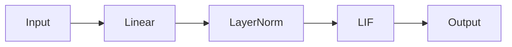
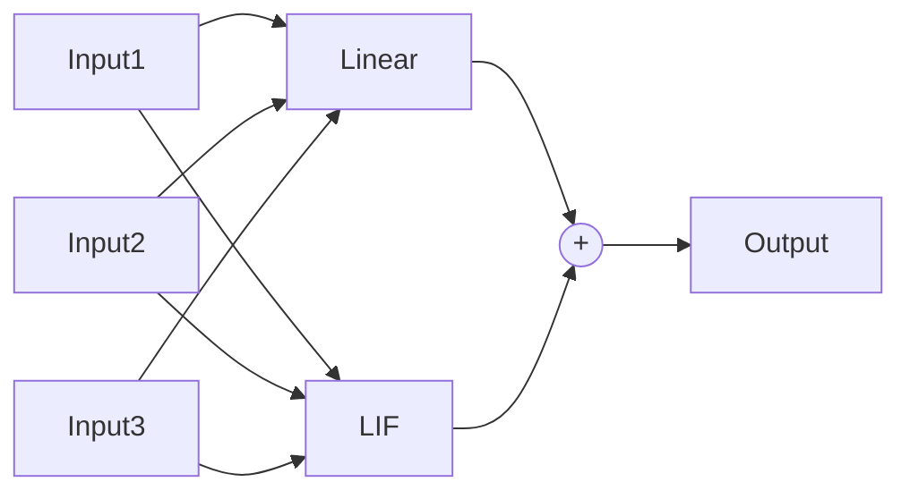
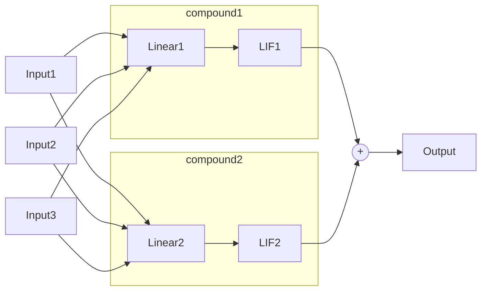
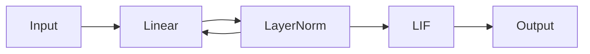
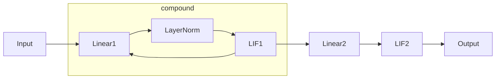

# Composed

The `snnax.snn.composed` module provides predefined architecture classes that inherit from [`StatefulModel`](./200_intro.md#statefulmodel) and can be used to build your model. The predefined architectures include:

- [`Sequential`](./201_composed.md#sequential): Constructs a feed-forward spiking neural network.
- [`Parallel`](./201_composed.md#parallel): Constructs a parallel spiking neural network.
- [`CompoundLayer`](./201_composed.md#compoundlayer): Groups together several layers.
- [`SequentialLocalFeedback`](./201_composed.md#sequentiallocalfeedback): Constructs a feed-forward spiking neural network with recurrent connections.

## Sequential

The `Sequential` class is a simple way to create a feed-forward SNN. It is a subclass of `StatefulModel` and allows the creation of a feed-forward SNN by stacking layers in sequence. It supports the defined `StatefulLayer` neuron types as well as Equinox layers. It constructs a connectivity graph with a feed-forward structure and feeds it to the `StatefulModel` class.

#### Arguments

- `layers (Sequence[eqx.Module])`: A sequence containing the Equinox modules and SNNAX stateful models in the network order.
- `forward_fn (Callable)`: The forward function used in the `lax.scan` loop to propagate the information through the feed-forward network. The default forward function [`default_forward_fn`](../400_functions.md#default_forward_fn) is used if not provided.

#### Example



```python
from snnax import snn
import equinox as eqx

layers = [
    eqx.Linear(10, 20),
    eqx.LayerNorm(20),
    snn.LIF()
]

feed_forward = snn.Sequential(*layers)

# Equivalent to:
feed_forward_graph_structure = snn.GraphStructure(
    num_layers=3,
    input_layer_ids=[[0], [], []],
    final_layer_ids=[2],
    input_connectivity=[[], [0], [1]]
)
feed_forward2 = snn.StatefulModel(
    graph_structure=feed_forward_graph_structure,
    layers=layers
)
```

## Parallel

The `Parallel` class is a simple way to create a parallel SNN. It is a subclass of `eqx.Module` and allows the creation of a parallel SNN by concatenating layers in parallel. The inputs, provided as a list in the same order as the layers, are distributed to each layer. The output is the sum of all layers. It supports the defined `StatefulLayer` neuron types as well as Equinox layers.

#### Arguments

- `layers (Sequence[eqx.Module])`: A sequence containing the Equinox modules and SNNAX stateful models in the network order. The output dimensions of layers must be broadcastable to the same shape under a sum operation.
- `forward_fn (Callable)`: The forward function used in the `lax.scan` loop to propagate the information through the network. The default forward function [`default_forward_fn`](../400_functions.md#default_forward_fn) is used if not provided.

#### Example

**1. Simple layers**



```python
from snnax import snn
import equinox as eqx

layers = [
    eqx.Linear(10, 20),
    snn.LIF()
]

parallel = snn.Parallel(*layers)
```

<br/>

**2. Compound layers**



```python
from snnax import snn
import equinox as eqx

compound1 = snn.CompoundLayer([
    eqx.Linear(10, 20),
    snn.LIF()
])
compound2 = snn.CompoundLayer([
    eqx.Linear(10, 20),
    snn.LIF()
])
layers = [compound1, compound2]

parallel = snn.Parallel(*layers)
```

## CompoundLayer

:::warning
This must be moved to layers
:::

The `CompoundLayer` class, a subclass of `StatefulLayer`, groups together several Equinox modules. This is useful for conveniently addressing compound layers as a single entity. It is essentially an Equinox module but with proper handling of the compound state.

#### Arguments

- `layers (Sequence[eqx.Module])`: A sequence containing the Equinox modules and SNNAX stateful layers.
- `init_fn`: Initialization function for the state of the layer.

#### Example

```python
from snnax import snn
import equinox as eqx

layers = [
    eqx.Linear(10, 20),
    eqx.LayerNorm(20),
    snn.LIF()
]

compound = snn.CompoundLayer(layers, init_fn)
```

## SequentialLocalFeedback

The `SequentialLocalFeedback` class creates a feed-forward SNN with self-recurrent connections. It is a subclass of `StatefulModel` and allows the creation of a feed-forward SNN by stacking layers in sequence. It constructs a connectivity graph with a feed-forward structure and local recurrent connections for each layer and feeds it to the `StatefulModel` class. It supports the defined `StatefulLayer` neuron types as well as Equinox layers.

:::note
By default, when `feedback_layers` is `None`, only `CompoundLayer` instances are recurrently connected to themselves. To connect other layers to themselves, provide a dictionary with the layer indices as keys and the feedback layer indices as values.
:::

#### Arguments

- `layers (Sequence[eqx.Module])`: A sequence containing the layers of the network in causal order.
- `forward_fn (Callable)`: The forward function used in the scan loop. The default forward function [`default_forward_fn`](../400_functions.md#default_forward_fn) is used if not provided.
- `feedback_layers (Optional[Dict[int, int]])`: A dictionary specifying which feedback connections to create. If omitted, all `CompoundLayer` instances will be connected to themselves (local feedback).

#### Example

**1. `feedback_layers` defined**



```python
from snnax import snn
import equinox as eqx

layers = [
    eqx.Linear(10, 20),
    eqx.LayerNorm(20),
    snn.LIF()
]

feedback_layers = {1: 0}

feed_forward = snn.SequentialLocalFeedback(layers, feedback_layers=feedback_layers)
```

<br/>

**2. `feedback_layers`=None**



```python
from snnax import snn
import equinox as eqx

compound = snn.CompoundLayer([
    eqx.Linear(10, 20),
    eqx.LayerNorm(20),
    snn.LIF()
])
layers = [compound, snn.LIF()]

feed_forward = snn.SequentialLocalFeedback(layers, feedback_layers=None)
```
