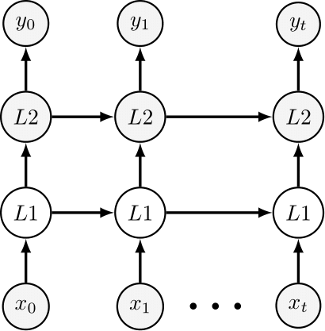

# Functions

SNNAX provides helper functions to facilitate the development of custom layers and models.
These functions are classified into the following categories:

- [`snnax.snn.functions.spiking`](./400_functions.md#spiking): Spike threshold functions with predefined custom surrogate gradient.
- [`snnax.snn.function.forward`](./400_functions.md#forward): Evaluation loop for the model.

## Spiking

The `spiking` module contains predefined Spike threshold functions for with custom surrogate gradients.
the available functions are:

### piecewise_surrogate

The `piecewise_surrogate` function is the simplest surrogate gradient which is a hat function with a fixed width 2`beta`.
The gradient of the surrogate function is given by:

$$
\frac{\partial f}{\partial x} =
\begin{cases}
1 & \text{if } -\beta \leq x \leq \beta \\
0 & \text{otherwise}
\end{cases}
$$

where:

- $x$ is the input to the surrogate function.
- $\dot{x}$ is the tangent of the input, representing the gradient with respect to $x$.

#### arguments

- `beta (float)`: The width of the hat function.

### superspike_surrogate

The `superspike_surrogate` function implements a surrogate gradient for approximating the spike function with a smooth function. This method is based on the work of [Zenke and Vogels](https://www.biorxiv.org/content/10.1101/2020.06.29.176925v1).
The gradient of the surrogate function is given by:

$$
\frac{\partial f}{\partial x}  = \frac{1}{\beta \cdot |x| + 1} \cdot \frac{\partial L}{\partial x}
$$

#### arguments

- `beta (float)`: The width of the hat function.

### sigmoid_surrogate

The `sigmoid_surrogate` function implements a surrogate gradient based on the sigmoid function. This method is based on the work of [Zenke and Vogels](https://www.biorxiv.org/content/10.1101/2020.06.29.176925v1)
The gradient of the surrogate function is given by:

$$
\frac{\partial f}{\partial x} = \sigma( \beta x) \cdot (1 - \beta \cdot \sigma(\beta x)) \cdot \frac{\partial L}{\partial x}
$$

#### Arguments

- `beta (float)`: The parameter for the sigmoid function.
  :::note
  For numerical stability, only `beta = 1.0` is supported.
  :::

## Forward

The `forward` module contains functions to evaluate the model.

#### Arguments

- `layers (Sequence[eqx.Module])`: A sequence containing the Equinox modules and SNNAX stateful models in the network order.
- `struct (GraphStructure)`: A `GraphStructure` object that specifies the network topology.
- `key (PRNGKey)`: Random key for the computation.
- `states (Sequence[Array])`: Initial states of the model.
- `data (Sequence[Array])`: Batch of input data.

### default_forward_fn

The `default_forward_fn` function computes the forward pass through the layers in a straight-through manner, i.e. every layer takes the input from the last layer at the same time step. The layers are traversed in the order specified by the connectivity graph.

<!-- make image small -->

#### Example

### debug_forward_fn

:::warning
This function is not implemented yet.
:::

The `debug_forward_fn` function computes the forward pass through the layers in a delayed manner, i.e. every layer takes the input from the last layer at the last time step. This means that the output of the last layer at the last timestep has to be saved which incurs a bigger memory usage. The layers are traversed in the order specified by the connectivity graph.
