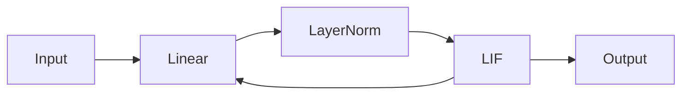
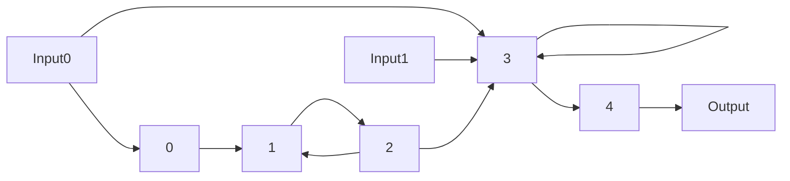

# Introduction

<!-- class GraphStructure(NamedTuple):
    """
    This class contains meta-information about the computational graph.
    It can be used in conjunction with the StatefulModel class to construct
    a computational model.

    Arguments:
        - `num_layers`: The number of layers we want to have in our model.
        - `input_layer_ids`: Index of the layers are provided with external input
        - `final_layer_ids`: Index of the layers whose output we want (deprecated).
        - `input_connectivity`: Specifies how the layers are connected to each other.
    """
    num_layers: int
    input_layer_ids: Sequence[Sequence[int]]
    final_layer_ids: Sequence[int]
    input_connectivity: Sequence[Sequence[int]] -->

<!-- class StatefulModel(eqx.Module):
"""
Class that allows the creation of custom SNNs with almost arbitrary
connectivity defined through a graph structure called the connectivity graph.
Has to inherit from eqx.Module to be a callable pytree.

    Example:
    ```python
    graph_structure = graph = snn.GraphStructure(3, [[0], [], []], [2], [[], [0], [1]])
    layers = [eqx.Linear(),
               eqx.LayerNorm(),
               snn.LIF()]

    model = StatefulModel(graph_structure=graph_structure,
                            layers=layers)
    ```

    Arguments:
        - `graph_structure`: GraphStructure object to specify network topology.
        - `layers`: Computational building blocks of the model.
        - `forward_fn`: Evaluation procedure/loop for the model.
                        Defaults to backprop through time using lax.scan().
    """
    graph_structure: GraphStructure = static_field()
    layers: Sequence[eqx.Module]
    forward_fn: Callable = static_field()

    def __init__(self,
                graph_structure: GraphStructure,
                layers: Sequence[eqx.Module],
                forward_fn: Callable = default_forward_fn) -> None: -->

In order to customize model's architecture, SNNAX provides a simple way to define the architecture of the model.

SNNAX provides two ways to define the architecture of the model:

- [`snnax.snn.architecture.StatefulModel`](./200_intro.md#statefulmodel): to create custom SNNs.
- [`snnax.snn.composed`](./201_composed.md): provides classes of predefined architectures that can be used to build your model.

## StatefulModel

The `StatefulModel` class allows the creation of custom SNNs with almost arbitrary connectivity defined through a graph structure called the connectivity graph. It has to inherit from `eqx.Module` to be a callable pytree.

It requires the following arguments:

- `graph_structure (GraphStructure)`: GraphStructure object to specify network topology.
- `layers (Sequence[eqx.Module])`: Computational building blocks of the model.
- `forward_fn (Callable)`: Evaluation procedure/loop for the model. Defaults to [`default_forward_fn`](../400_functions/400_intro.md).

First we need to define our layers that can be from the `equinox` library or SNNAX [snnax.snn.layers](../300_layers/300_intro.md).

```python
from snnax import snn
import equinox as eqx

layers = [eqx.Linear(),
           eqx.LayerNorm(),
           snn.LIF()]
```

Then we need to define the [`GraphStructure`](./200_intro.md#graphstructure) object which contains meta-information about the computational graph.

```python
graph_structure = snn.GraphStructure(3, [[0], [], []], [2], [[2], [0], [1]])
```

Finally, we can create the `StatefulModel` object by passing the `graph_structure` and `layers` as arguments.

```python
model = snn.StatefulModel(graph_structure=graph_structure,
                            layers=layers)
```

and the model architecture will be:



### GraphStructure

The `GraphStructure` class contains meta-information about the computational graph. It can be used in conjunction with the `StatefulModel` class to construct a computational model.

The `GraphStructure` class requires the following arguments:

- `num_layers (int)`: The number of layers we want to have in our model.
- `input_layer_ids (Sequence[Sequence[int]])`: Index of the layers are provided with external input.
- `final_layer_ids (Sequence[int])`: Index of the layers whose output we want.
- `input_connectivity (Sequence[Sequence[int]])`: Specifies how the layers are connected to each other.

Example:

```python
graph_structure = snn.GraphStructure(5, [[0], [], [], [0, 1], []], [4], [[], [0, 2], [1], [2, 3], [3]])
```


