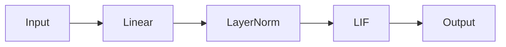
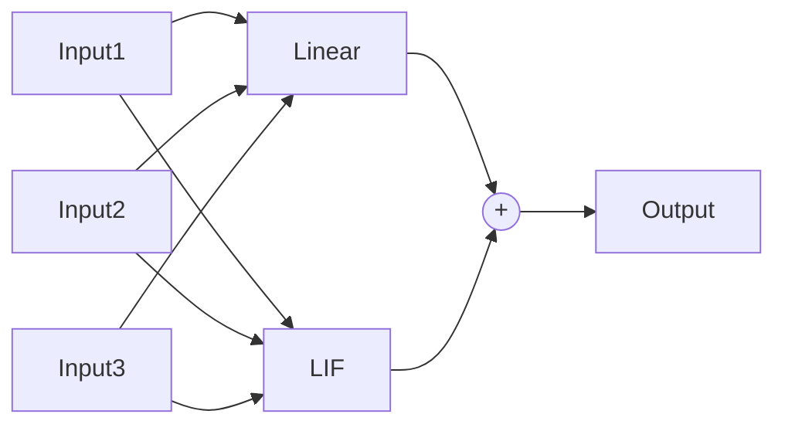
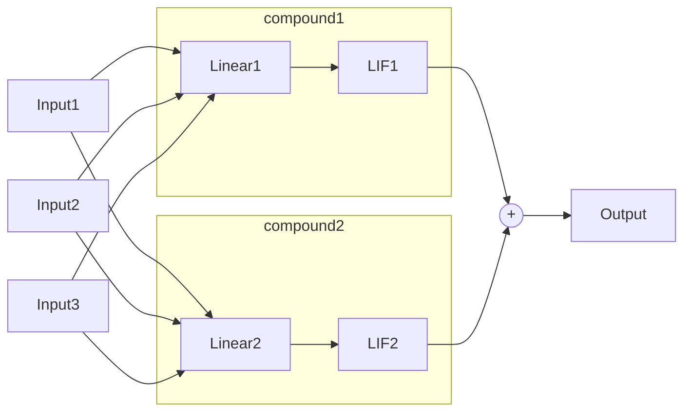
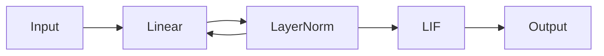
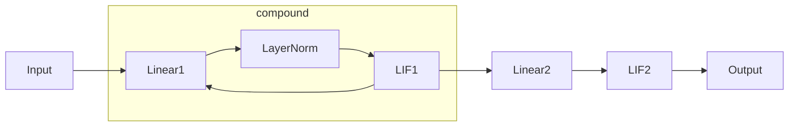

# Composed

`snnax.snn.composed` provides predefined architectures classes that inherit from [`StatefulModel`](./200_intro.md#statefulmodel) that can be used to build your model.
The predefined architectures are:

- [`Sequential`](./201_composed.md#sequential): construct a feed-forward spiking neural network.
- [`Parallel`](./201_composed.md#parallel): construct a parallel spiking neural network.
- [`CompoundLayer`](./201_composed.md#compoundlayer): groups together several layers.
- [`SequentialLocalFeedback`](./201_composed.md#sequentiallocalfeedback): construct a feed-forward spiking neural network with recurrent connections.

## Sequential

<!-- Convenience class to construct a feed-forward spiking neural network in a
    simple manner. It supports the defined `StatefulLayer` neuron types as well
    as Equinox layers. It constructs a connectivity graph with a `feed-forward`
    structure and feeds it to the StatefulModel class. -->

The `Sequential` class is a simple way to create a feed-forward SNN. It is a subclass of `StatefulModel` and allows the creation of a feed-forward SNN by stacking layers in a sequence. It supports the defined `StatefulLayer` neuron types as well as Equinox layers.
It constructs a connectivity graph with a `feed-forward` structure and feeds it to the `StatefulModel` class

It requires the following arguments:

- `layers (Sequence[eqx.Module])`: Sequence containing the equinox modules and snnax stateful models of the network order.
- `forward_fn (Callable)`: Forward function used in the `lax.scan` loop to propagate the information through the feed-forward network. The default forward function [`default_forward_fn`](../400_functions/400_intro.md) is used if not provided.

### Example



```python
from snnax import snn
import equinox as eqx

layers = [eqx.Linear(),
            eqx.LayerNorm(),
            snn.LIF()]

feed_forward = Sequential(*layers)

# Equivalent to
feed_forward_graph_structure = snn.GraphStructure(3, [[0], [], []], [2], [[], [0], [1]])
feed_forward2 = snn.StatefulModel(graph_structure=graph_structure,
                                layers=layers)
```

## Parallel

The `Parallel` class is a simple way to create a parallel SNN. It is a subclass of `eqx.Module` and allows the creation of a parallel SNN by concatenating layers in parallel. The inputs provided as a list in the same order as the layers are distributed to each layer. The output is the sum of all layers.
It supports the defined `StatefulLayer` neuron types as well as `Equinox` layers.

It requires the following arguments:

- `layers (Sequence[eqx.Module])`: Sequence containing the equinox modules and snnax stateful models of the network order. The order used must be the same as the order used in the `__call__` function. The output dimensions of layers must be broadcastable to the same shape under a sum operation.
- `forward_fn (Callable)`: Forward function used in the `lax.scan` loop to propagate the information through the feed-forward network. The default forward function [`default_forward_fn`](../400_functions/400_intro.md) is used if not provided.

### Example

**1. Simple layers**



```python
from snnax import snn
import equinox as eqx

layers = [eqx.Linear(),
            snn.LIF()]

parallel = Parallel(*layers)
```

<br/>

**2. Compound layers**



```python
from snnax import snn
import equinox as eqx

compound1 = snn.CompoundLayer([eqx.Linear(),
                                snn.LIF()])
compound2 = snn.CompoundLayer([eqx.Linear(),
                                snn.LIF()])
layers = [compound1,
            compound2]

parallel = Parallel(*layers)
```

## CompoundLayer

:::warning
This must be moved to layers
:::

The `CompoundLayer` is a subclass of `StatefulLayer` groups together several `Equinox` modules. This is useful for conveniently addressing compound layers as a single one. It is essentially like an Equinox module but with the proper handling of the compound state.

It requires the following arguments:

- `layers (Sequence[eqx.Module])`: Sequence containing the equinox modules and SNNAX stateful layers
- `init_fn`: Initialization function for the state of the layer

### Example

```python
from snnax import snn
import equinox as eqx

layers = [eqx.Linear(),
            eqx.LayerNorm(),
            snn.LIF()]

compound = CompoundLayer(layers, init_fn)
```

## SequentialLocalFeedback

<!-- Convenience class to construct a feed-forward spiking neural network with
    self recurrent connections in a simple manner. It supports the defined
    StatefulLayer neuron types as well as equinox layers. Under the hood it
    constructs a connectivity graph with a feed-forward structure and local
    recurrent connections for each layer and feeds it to the StatefulModel class.

    Important: By default, when feedback_layers is None, only CompoundLayer are
    recurrently connected to themselves. If you want to connect other layers to
    themselves, you need to provide a dictionary with the layer indices as keys
    and the feedback layer indices as values. -->

The `SequentialLocalFeedback` class is a simple way to create a feed-forward SNN with self-recurrent connections. It is a subclass of `StatefulModel` and allows the creation of a feed-forward SNN by stacking layers in a sequence. It constructs a connectivity graph with a `feed-forward` structure and local recurrent connections for each layer and feeds it to the `StatefulModel` class.
It supports the defined `StatefulLayer` neuron types as well as Equinox layers.

:::note
By default, when `feedback_layers` is `None`, only `CompoundLayer` are recurrently connected to themselves. If you want to connect other layers to themselves, you need to provide a dictionary with the layer indices as keys and the feedback layer indices as values.
:::

It requires the following arguments:

- `layers`: Sequence containing the layers of the network in causal order.
- `forward_fn`: forward function used in the scan loop. default forward function `default_forward_fn` used if not provided
- `feedback_layers`: dictionary of which feedback connections to create. If omitted, all CompoundLayers will be connected to themselves (local feedback)

### Example

**1. `feedback_layers` defined**



```python
from snnax import snn
import equinox as eqx

layers = [eqx.Linear(),
            eqx.LayerNorm(),
            snn.LIF()]

feedback_layers = {1: 0}

feed_forward = snn.SequentialLocalFeedback(layers, feedback_layers=feedback_layers)
```

<br/>

**2. `feedback_layers`=None**



```python
from snnax import snn
import equinox as eqx

compound = snn.CompoundLayer([eqx.Linear(),
                                eqx.LayerNorm(),
                                snn.LIF()])
layers = [compound,
            snn.LIF()]

feed_forward = snn.SequentialLocalFeedback(layers, feedback_layers=None)
```
